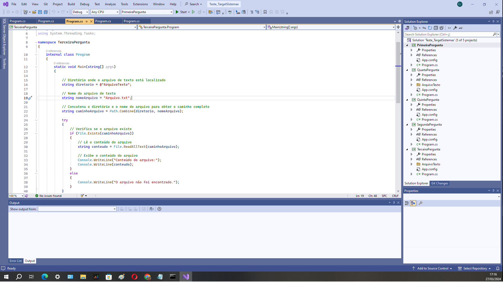

# TESTE TARGETSISTEMAS
 
<h1 align="center">
    
</h1>
 
# Estágio Ribeirão Preto - 2024
 
- Teste referente a vaga de estágio Ribeirão Preto - 2024 na Target Sistemas; 
 
- Este teste contem 5 perguntas que foram respondidas em formato de sistema;
 
- Para esta solução basta executar cada sistema que as respostas do teste serão respondidas e apresentadas e tela.
 

## SOFTWARE UTILIZADOS 
- Visual Studio 2022
- Linguagem C# console
